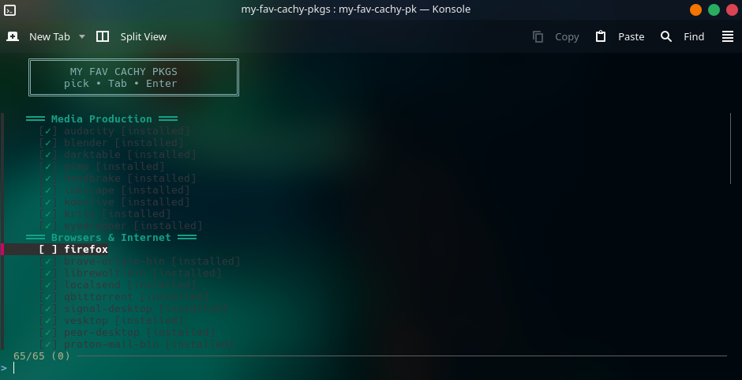

# my-fav-cachy-pkgs

I made this script to help me quickly install my favorite packages on any CachyOS machine. It's my personal pick-list of packages, wrapped in a clean TUI.
Whether it's for my own machines or for friends finally leaving Windows behind, this script gets a fresh system loaded with everything I actually use.

Built with a little help from opencode.



## Usage

```bash
./my-fav-cachy-pkgs
```

Arrow keys to navigate, Tab to toggle packages, Enter to review and install.

## Features

- One menu for official repos, AUR (via paru), and Flatpaks
- Installed packages dimmed with `[installed]` badge
- Confirmation step before any system changes
- sudo used only for actual installation

## Packages by section

| Section | Count | Source |
|---|---|---|
| Media Production | 9 | repo |
| Browsers & Internet | 7 | repo |
| Gaming | 3 | repo |
| Productivity & Cloud | 4 | repo |
| System Tools | 8 | repo |
| Media Playback | 2 | repo |
| Security | 1 | repo |
| GPU & Display | 2 | repo |
| VPN & Remote | 1 | repo |
| AUR Only | 11 | aur |
| Flatpaks | 2 | flatpak |
