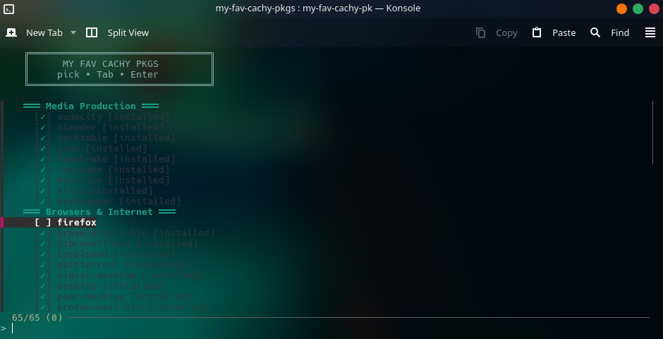

# my-fav-cachy-pkgs

I made this script to help me quickly install my favorite packages on any CachyOS machine. It's my personal pick-list of packages, wrapped in a clean TUI.
Whether it's for my own machines or for friends finally leaving Windows behind, this script gets a fresh system loaded with everything I actually use.

Built with a little help from opencode.

Current version: **1.1** (run `./my-fav-cachy-pkgs --version`). Release notes in [CHANGELOG.md](CHANGELOG.md).

Distributed under the [GNU General Public License v3.0](LICENSE).



## Usage

```bash
./my-fav-cachy-pkgs
```

Arrow keys to navigate, Tab to toggle packages, Enter to review and install.

## Features

- One menu for official repos, AUR (via paru), and Flatpaks
- Installed packages dimmed with `[installed]` badge
- Dark gray background, so it stays readable on transparent terminals
- Confirmation step before any system changes
- sudo used only for actual installation

## Packages by section

| Section | Count | Source |
|---|---|---|
| Media Production | 9 | repo |
| Browsers & Internet | 8 | repo |
| Gaming | 5 | repo |
| Productivity & Cloud | 5 | repo |
| System Tools | 11 | repo |
| Media Playback | 2 | repo |
| Security | 1 | repo |
| GPU & Display | 3 | repo |
| VPN & Remote | 1 | repo |
| AUR Only | 14 | aur |
| Flatpaks | 2 | flatpak |

AUR packages are grouped by topic inside the picker:

- **Gaming** — `millennium`, `r2modman-bin`, `steamcmd`
- **Media & Photos** — `filebot`, `qwinff`, `upscayl-bin`
- **AI & Notes** — `lmstudio-bin`, `opencode-bin`, `triliumnext-bin`
- **Remote & Sync** — `rustdesk-bin`
- **Utilities** — `beacn-utility`, `ookla-speedtest-bin`, `pipeweaver`, `sc0710-dkms-git`
